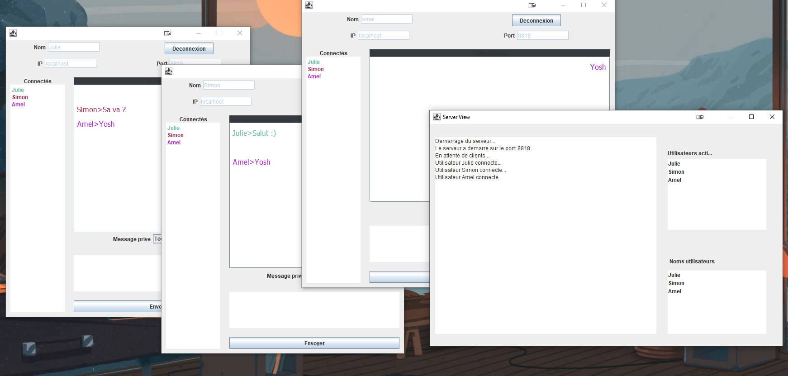

# Application Chat  Client–serveur

Projet développé dans le cadre du module "Programmation Orientée Objet et Java" de la 3ème année de Licence Informatique (Le Mans Université).

#### Fonctionnalités implémentées :

- 🐏 Envoi message broadcast (Message diffusé à tous les clients).
- 🐏 Envoi message unicast ( Message diffusé à un client sélectionné).
- 😽 Code couleur utilisateur ( chaque client a une couleur attribuée). 
- 😽 Gestion d'erreur en cas d'identifiants de connexions erronées.
- ⚡ Deconnexion/Reconnexion à partir d'une même fenêtre.
- 🐏 Notifications de déconnexions aux clients connectés.

#### Comment l'utiliser ? 
- Lancer le serveur => compiler et exécuter : ServerFrame.java
- Ouvrir des fenêtres pour les clients => compiler et executer ClientFrame.java
- Saisir le nom du client, l'adresse IP [localhost] et le port [8818]
- Se connecter

Enjoy !! 😽

/!\ Il est impératif de lancer le serveur avant de procéder à une connexion.
